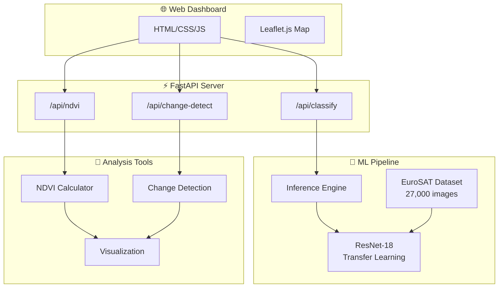

# 🛰️ Satellite Imagery Analyzer

[](https://github.com/yourusername/satellite-imagery-analyzer/actions)
[](https://www.python.org/downloads/)
[](LICENSE)
[](https://pytorch.org/)

> **Classify satellite images, analyze vegetation health, and detect environmental changes using deep learning — powered by real NASA/ESA satellite data.**

---

## 🌍 Overview

Satellite Imagery Analyzer is a Python-based tool that combines **deep learning** with **remote sensing** to analyze satellite imagery. It provides three core capabilities:

| Feature | Description |
|---------|-------------|
| 🧠 **Land Use Classification** | Classifies satellite images into 10 categories using a CNN with transfer learning (ResNet-18) |
| 🌿 **NDVI Vegetation Analysis** | Calculates the Normalized Difference Vegetation Index to assess vegetation health |
| 🔄 **Change Detection** | Compares imagery across time periods to detect deforestation, urbanization, and more |

The project includes an interactive **web dashboard** for uploading images and visualizing results.

---

## 🏗️ Architecture



---

## 📊 Dataset: EuroSAT

This project uses the [EuroSAT](https://github.com/phelber/eurosat) dataset — 27,000 labeled Sentinel-2 satellite images across **10 land use classes**:

| Class | Description | Class | Description |
|-------|-------------|-------|-------------|
| 🌾 AnnualCrop | Seasonal farmland | 🏭 Industrial | Factories, warehouses |
| 🌲 Forest | Dense tree cover | 🌿 Pasture | Grazing land |
| 🌱 HerbaceousVeg | Grasslands | 🍇 PermanentCrop | Orchards, vineyards |
| 🛣️ Highway | Roads, highways | 🏘️ Residential | Housing areas |
| 🏞️ River | Waterways | 🌊 SeaLake | Large water bodies |

- **Source:** ESA Sentinel-2 satellite
- **Resolution:** 64×64 pixels at 10m ground sampling distance
- **Format:** RGB JPEG images

---

## 🚀 Quick Start

### 1. Clone & Install

```bash
git clone https://github.com/yourusername/satellite-imagery-analyzer.git
cd satellite-imagery-analyzer

# Create virtual environment (recommended)
python -m venv venv
source venv/bin/activate  # macOS/Linux
# venv\Scripts\activate   # Windows

# Install dependencies
pip install -r requirements.txt
```

### 2. Download Dataset

```bash
python data/download_eurosat.py
```

This downloads the EuroSAT RGB dataset (~90MB) and organizes it into the expected directory structure.

### 3. Train the Model

```bash
python -m src.model.train --epochs 25 --batch-size 64 --lr 0.001
```

Training takes ~5 min on GPU or ~20 min on CPU. The best model is saved to `models/best_model.pth`.

**Expected accuracy: 95-98%** on the test set.

### 4. Run the Dashboard

```bash
python -m src.api.app
```

Open [http://localhost:8000](http://localhost:8000) in your browser.

---

## 🖥️ Web Dashboard

The interactive dashboard provides three analysis modes:

### Classify
Upload a satellite image and get instant classification with confidence scores for all 10 land use categories.

### NDVI Analysis
Upload NIR and Red spectral bands (or use demo data) to generate vegetation health heatmaps with statistics.

### Change Detection
Upload before/after image pairs to detect and visualize environmental changes over time.

---

## 🔧 CLI Usage

### Classify a Single Image

```bash
python -m src.model.predict --image path/to/satellite_image.jpg
```

### Batch Classification

```bash
python -m src.model.predict --image-dir path/to/image_directory/
```

---

## 🌿 NDVI Analysis

The Normalized Difference Vegetation Index (NDVI) measures vegetation health:

$$\text{NDVI} = \frac{\text{NIR} - \text{Red}}{\text{NIR} + \text{Red}}$$

| NDVI Range | Classification | Interpretation |
|-----------|---------------|----------------|
| -1.0 to 0.0 | Water | Lakes, rivers, ocean |
| 0.0 to 0.1 | Barren/Built-up | Urban areas, bare soil |
| 0.1 to 0.3 | Sparse Vegetation | Shrubs, grassland |
| 0.3 to 0.6 | Moderate Vegetation | Cropland, light forest |
| 0.6 to 1.0 | Dense Vegetation | Tropical forest, healthy crops |

---

## 🧪 Testing

```bash
# Run all tests
pytest tests/ -v

# Run specific test suite
pytest tests/test_model.py -v
pytest tests/test_ndvi.py -v
pytest tests/test_api.py -v

# Run with coverage
pytest tests/ -v --cov=src --cov-report=term-missing
```

---

## 📁 Project Structure

```
satellite-imagery-analyzer/
├── README.md                    # This file
├── requirements.txt             # Python dependencies
├── setup.py                     # Package configuration
├── .github/workflows/ci.yml     # GitHub Actions CI pipeline
│
├── data/
│   ├── download_eurosat.py      # Dataset download script
│   └── README.md                # Dataset documentation
│
├── src/
│   ├── config.py                # Centralized configuration
│   ├── model/
│   │   ├── classifier.py        # ResNet-18 transfer learning model
│   │   ├── dataset.py           # PyTorch Dataset & DataLoader
│   │   ├── train.py             # Training pipeline
│   │   └── predict.py           # Inference engine
│   ├── analysis/
│   │   ├── ndvi.py              # NDVI calculation
│   │   ├── change_detection.py  # Temporal change detection
│   │   └── visualization.py     # Plotting utilities
│   └── api/
│       └── app.py               # FastAPI web server
│
├── frontend/
│   ├── index.html               # Dashboard UI
│   ├── style.css                # Styling
│   └── app.js                   # Frontend logic
│
├── models/                      # Saved model checkpoints
├── tests/                       # Test suite
└── notebooks/                   # Jupyter notebooks
```

---

## 🛠️ Tech Stack

- **ML Framework:** PyTorch + torchvision
- **Model:** ResNet-18 (pretrained on ImageNet, fine-tuned on EuroSAT)
- **Backend:** FastAPI + Uvicorn
- **Frontend:** Vanilla HTML/CSS/JS + Leaflet.js
- **Data Source:** EuroSAT (Sentinel-2) + NASA Earthdata API
- **Testing:** pytest + GitHub Actions CI
- **Visualization:** Matplotlib + Seaborn

---

## 📚 References

- **EuroSAT Dataset:** Helber, P., Bischke, B., Dengel, A., & Borth, D. (2019). *EuroSAT: A Novel Dataset and Deep Learning Benchmark for Land Use and Land Cover Classification.* IEEE Journal of Selected Topics in Applied Earth Observations and Remote Sensing.
- **NASA Earthdata:** [https://earthdata.nasa.gov/](https://earthdata.nasa.gov/)
- **Sentinel-2:** [https://sentinel.esa.int/web/sentinel/missions/sentinel-2](https://sentinel.esa.int/web/sentinel/missions/sentinel-2)

---

## 📄 License

This project is licensed under the MIT License — see the [LICENSE](LICENSE) file for details.

---

## 🤝 Contributing

Contributions are welcome! Please open an issue or submit a pull request.

1. Fork the repository
2. Create a feature branch (`git checkout -b feature/amazing-feature`)
3. Commit your changes (`git commit -m 'Add amazing feature'`)
4. Push to the branch (`git push origin feature/amazing-feature`)
5. Open a Pull Request

---

<p align="center">
  <br/>
  Powered by <a href="https://earthdata.nasa.gov/">NASA Earthdata</a> & <a href="https://github.com/phelber/eurosat">EuroSAT</a>
</p>
